# Secure the Realm - System Architecture

## Document Information

- **Version**: 1.0
- **Last Updated**: 2025-10-15
- **Status**: Active
- **Related Documents**: [Product Requirements Document](prd.md), [ADR Index](adr/index.md)

## Table of Contents

1. [Introduction](#introduction)
2. [System Context](#system-context)
3. [Container Architecture](#container-architecture)
4. [AI Agent System](#ai-agent-system)
5. [Frontend Architecture](#frontend-architecture)
6. [Backend Architecture](#backend-architecture)
7. [Workflow Sequences](#workflow-sequences)
8. [Data Architecture](#data-architecture)
9. [Deployment Architecture](#deployment-architecture)
10. [Technology Stack](#technology-stack)
11. [Key Architectural Decisions](#key-architectural-decisions)

---

## Introduction

### Overview

Secure the Realm is an AI-powered tabletop RPG platform that provides a complete Dungeon Master experience through specialized AI agents. The platform democratizes access to high-quality D&D 5e gameplay by eliminating the need for a human DM while preserving creativity, flexibility, and immersion.

### Architectural Goals

The architecture is designed to achieve:

1. **Specialized Intelligence**: Six AI agents with distinct roles working in concert
2. **Real-time Interaction**: Immediate response to player actions through chat interface
3. **Visual Richness**: Generated battle maps, character portraits, and scene illustrations
4. **Game Rules Fidelity**: Complete D&D 5e OGL SRD compliance with automated rules enforcement
5. **State Persistence**: Save/resume campaigns with full character progression tracking
6. **Scalability**: Support for future multiplayer and advanced features

### Key Design Principles

- **Multi-Agent Orchestration**: Leverage Azure AI Agents SDK for coordinating specialized AI agents
- **Clear Separation of Concerns**: Frontend (presentation), Backend (orchestration), Agents (intelligence), Data (persistence)
- **Plugin-Based Extensibility**: Modular plugins for game rules, narrative generation, and image creation
- **API-First Design**: OpenAPI-compliant REST API with generated TypeScript client
- **Cloud-Native Deployment**: Azure Container Apps for backend, Static Web Apps for frontend

---

## System Context

### High-Level System View

The following diagram shows Secure the Realm in the context of its users and external systems:

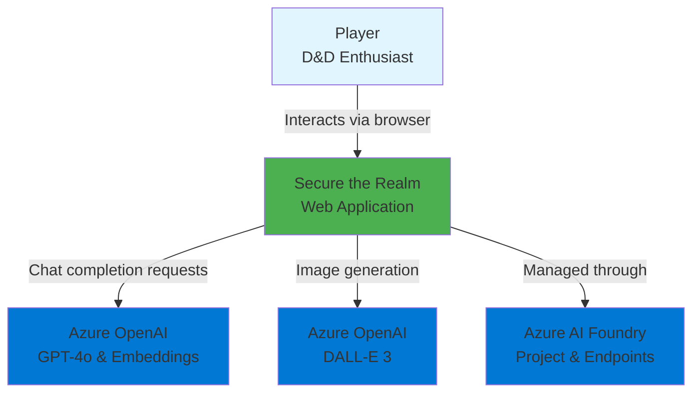

### External Dependencies

| System | Purpose | Integration Method |
|--------|---------|-------------------|
| **Azure AI Foundry** | Unified AI platform for model deployment | Azure AI Agents SDK (azure-ai-agents, azure-ai-projects) |
| **Azure OpenAI - GPT-4o-mini** | Chat completion for AI agent reasoning | Azure AI Inference API |
| **Azure OpenAI - text-embedding-ada-002** | Embeddings for semantic search | Azure AI Inference API |
| **Azure OpenAI - DALL-E 3** | Image generation for battle maps and art | Azure AI Inference API |

### User Interactions

Players interact with the system through:

1. **Campaign Setup**: Create campaigns with custom settings, tone, and world-building
2. **Character Creation**: Build D&D 5e characters with race, class, background, and stats
3. **Natural Language Gameplay**: Chat with AI DM using conversational language
4. **Visual Feedback**: View generated battle maps and artwork
5. **Character Management**: Track inventory, spells, abilities, and progression
6. **Session Persistence**: Save and resume campaigns across multiple sessions

---

## Container Architecture

### System Containers

Secure the Realm consists of four primary containers working together to deliver the complete experience:

```mermaid
graph TB
    subgraph "User's Browser"
        Frontend[React Frontend<br/>TypeScript + Vite<br/>Port 5173]
    end

    subgraph "Backend Server"
        API[FastAPI Application<br/>Python 3.12+<br/>Port 8000]
    end

    subgraph "AI Agent System"
        AgentOrchestrator[Azure AI Agents SDK<br/>Multi-Agent Orchestration]
        DM[Dungeon Master Agent]
        Narrator[Narrator Agent]
        Scribe[Scribe Agent]
        CombatMC[Combat MC Agent]
        Cartographer[Combat Cartographer]
        Artist[Artist Agent]
    end

    subgraph "Data Storage"
        SQLite[(SQLite Database<br/>Campaigns, Characters,<br/>Game State)]
    end

    subgraph "External Services"
        AzureOpenAI[Azure OpenAI<br/>GPT-4o-mini]
        DALLE[DALL-E 3<br/>Image Generation]
    end

    Frontend -->|HTTP/REST API<br/>WebSocket| API
    API --> AgentOrchestrator
    AgentOrchestrator --> DM
    AgentOrchestrator --> Narrator
    AgentOrchestrator --> Scribe
    AgentOrchestrator --> CombatMC
    AgentOrchestrator --> Cartographer
    AgentOrchestrator --> Artist
    API --> SQLite
    AgentOrchestrator -->|Chat Completion| AzureOpenAI
    Artist -->|Image Requests| DALLE
    Cartographer -->|Map Requests| DALLE

    style Frontend fill:#61DAFB
    style API fill:#009688
    style AgentOrchestrator fill:#FF6F00
    style DM fill:#FFA726
    style Narrator fill:#FFA726
    style Scribe fill:#FFA726
    style CombatMC fill:#FFA726
    style Cartographer fill:#FFA726
    style Artist fill:#FFA726
    style SQLite fill:#003B57
    style AzureOpenAI fill:#0078D4
    style DALLE fill:#0078D4
```

### Container Descriptions

#### 1. React Frontend

**Technology**: TypeScript, React 18, Vite, Material-UI

**Responsibilities**:
- Present chat interface for player-DM interaction
- Display character sheets with live stat tracking
- Show battle maps and artwork in dedicated viewing areas
- Handle dice rolling visualization
- Manage local UI state and session data

**Key Features**:
- Generated OpenAPI TypeScript client for type-safe API calls
- Real-time updates via WebSocket connection
- Responsive design for various screen sizes
- Optimistic UI updates for better perceived performance

**Entry Point**: `frontend/src/main.tsx`

#### 2. FastAPI Backend

**Technology**: Python 3.12+, FastAPI, Uvicorn, UV package manager

**Responsibilities**:
- Expose REST API endpoints for campaign and character management
- Handle WebSocket connections for real-time gameplay
- Orchestrate AI agent interactions via Azure AI Agents SDK
- Manage game state persistence to database
- Run database migrations via Alembic
- Enforce D&D 5e rules through validation logic

**Key Features**:
- OpenAPI schema auto-generation
- CORS middleware for cross-origin requests
- Lifespan events for startup/shutdown handling
- Comprehensive pytest test suite

**Entry Point**: `backend/app/main.py`

**Key Modules**:
- `app/api/` - Route handlers for game operations
- `app/agents/` - AI agent definitions and prompts
- `app/services/` - Business logic and orchestration
- `app/models/` - Pydantic data models and SQLAlchemy ORM
- `app/plugins/` - Semantic Kernel plugins for agent capabilities

#### 3. AI Agent System

**Technology**: Azure AI Agents SDK (azure-ai-agents, azure-ai-projects)

**Responsibilities**:
- Coordinate six specialized AI agents via orchestrator pattern
- Route player requests to appropriate agent(s)
- Synthesize multi-agent responses into coherent output
- Maintain agent context and conversation history
- Execute plugins for deterministic game operations

**Agent Specializations**:

| Agent | Role | Key Functions |
|-------|------|---------------|
| **Dungeon Master** | Orchestrator | Coordinates all agents, manages player interaction flow |
| **Narrator** | Storytelling | Generates narrative, manages skill checks, maintains campaign facts |
| **Scribe** | Data Management | Tracks character sheets, inventory, NPCs, progression |
| **Combat MC** | Combat Management | Creates encounters, manages initiative, controls enemy tactics |
| **Combat Cartographer** | Map Generation | Generates tactical battle maps based on narrative context |
| **Artist** | Visual Generation | Creates character portraits, scene illustrations, item visuals |

**Agent Communication**: Determined by Azure AI Agents SDK orchestration layer, allowing both sequential and parallel agent execution based on task requirements.

#### 4. Data Storage

**Technology**: SQLite (development), Alembic for migrations

**Responsibilities**:
- Persist campaign configurations and world state
- Store character sheets with full D&D 5e attributes
- Track game session history and player actions
- Maintain narrative facts for story continuity
- Store NPC data and encounter information

**Key Tables** (via SQLAlchemy ORM):
- `campaigns` - Campaign metadata and settings
- `characters` - Full D&D 5e character sheets
- `game_sessions` - Session history and timestamps
- `narrative_facts` - Story elements and world facts
- `npcs` - Non-player character data

**Migration Management**: Alembic handles schema evolution with version-controlled migration scripts in `backend/migrations/`.

### Container Communication Patterns

#### Frontend ↔ Backend

1. **REST API** (Primary):
   - Campaign CRUD operations
   - Character creation and retrieval
   - Game state queries
   - Generated TypeScript client ensures type safety

2. **WebSocket** (Real-time gameplay):
   - Player messages to AI DM
   - AI agent responses streamed back
   - Live game state updates
   - Dice roll notifications

#### Backend ↔ AI Agents

- Azure AI Agents SDK orchestration layer
- Plugin invocations for deterministic operations (dice rolls, rules checks)
- Context sharing via agent message threads
- Parallel agent execution for independent tasks

#### Backend ↔ Data Storage

- SQLAlchemy ORM for database operations
- Transaction management for data consistency
- Query optimization for character and campaign retrieval

#### AI Agents ↔ Azure OpenAI

- Chat completion API for agent reasoning
- Embeddings API for semantic search (future)
- Image generation API for DALL-E 3 (Artist and Cartographer agents)
- Managed via Azure AI Inference client

---

## AI Agent System

### Agent Architecture Overview

The AI Agent System is the intelligence layer of Secure the Realm. It uses the **Azure AI Agents SDK** to orchestrate six specialized agents that work together to deliver the complete Dungeon Master experience.

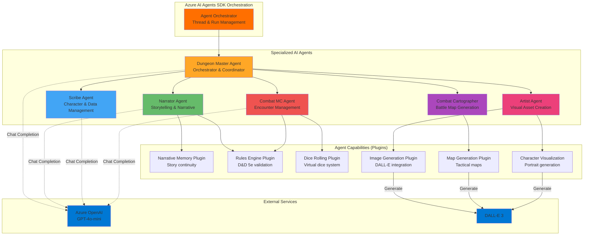

### Agent Definitions

#### 1. Dungeon Master Agent (Orchestrator)

**Primary Role**: Central coordinator and player-facing interface

**Responsibilities**:
- Manage conversation flow with player
- Route requests to specialized agents
- Synthesize multi-agent responses into coherent narrative
- Maintain overall game pacing and tone
- Ensure continuity across all agent outputs

**Key Decisions**:
- Which agent(s) should handle current player action
- When to invoke multiple agents in parallel vs. sequence
- How to blend responses from multiple agents
- When to request clarification from player

**Implementation**: `backend/app/agents/dungeon_master_agent.py`

#### 2. Narrator Agent

**Primary Role**: Campaign narrative and storytelling

**Responsibilities**:
- Generate environmental descriptions and scene-setting
- Determine when skill checks are required
- Adjudicate skill check outcomes
- Maintain campaign narrative facts and world continuity
- Create NPC dialogue and personality
- Interpret player actions within story context

**Plugins Used**:
- **Narrative Memory Plugin**: Stores and retrieves story facts
- **Rules Engine Plugin**: Validates D&D 5e skill check requirements
- **Narrative Generation Plugin**: Structures compelling descriptions

**Data Managed**:
- Campaign setting and world details
- Story arcs and plot threads
- Important events and decisions
- NPC personalities and relationships

**Implementation**: `backend/app/agents/narrator_agent.py`

#### 3. Scribe Agent

**Primary Role**: Character and game data management

**Responsibilities**:
- Track character sheets with full D&D 5e attributes
- Manage inventory, equipment, and loot
- Monitor spell slots, abilities, and resources
- Handle character progression (XP, leveling, ability improvements)
- Store and retrieve NPC statistics
- Validate character actions against available resources

**Data Managed**:
- Complete character sheets (stats, skills, feats, etc.)
- Inventory and equipment tracking
- Spell slots and prepared spells
- Character progression history
- NPC stat blocks

**D&D 5e Rules Enforced**:
- Ability score calculations
- Proficiency bonus scaling
- Level-up requirements (XP thresholds)
- Ability score improvements at levels 4, 8, 12, 16, 19
- Hit point calculations with class hit dice
- Feat prerequisites and effects

**Implementation**: `backend/app/agents/scribe_agent.py`

#### 4. Combat MC Agent

**Primary Role**: Combat encounter management

**Responsibilities**:
- Design balanced encounters based on party level
- Control enemy tactics and behaviors
- Manage initiative order
- Track combat state (HP, conditions, positions)
- Adjudicate attack rolls and damage
- Determine when combat ends

**Plugins Used**:
- **Dice Rolling Plugin**: Handle attack rolls, damage, saves
- **Rules Engine Plugin**: Validate combat actions and rules
- **Tactical Analysis Plugin**: Optimize enemy tactics

**Combat Elements Managed**:
- Initiative order and turn tracking
- Attack rolls (to-hit, damage)
- Saving throws
- Status effects and conditions
- Environmental hazards
- Enemy AI decision-making

**Implementation**: `backend/app/agents/combat_mc_agent.py`

#### 5. Combat Cartographer Agent

**Primary Role**: Tactical battle map generation

**Responsibilities**:
- Generate visual battle maps based on narrative context
- Position combatants appropriately
- Include terrain features and hazards
- Ensure tactical interest and challenge
- Update maps as combat progresses

**Plugins Used**:
- **Map Generation Plugin**: Interfaces with DALL-E 3
- **Terrain Assessment Plugin**: Evaluates tactical features
- **Battle Positioning Plugin**: Places combatants effectively

**Map Generation Process**:
1. Receive narrative context from Narrator
2. Determine map size and terrain type
3. Generate detailed prompt for DALL-E 3
4. Create grid-based tactical map
5. Return image URL for frontend display

**Implementation**: `backend/app/agents/combat_cartographer_agent.py`
**Azure Integration**: Relies on `AzureOpenAIClient` for DALL·E map renders with graceful fallback messaging when Azure configuration is unavailable.

#### 6. Artist Agent

**Primary Role**: Visual asset creation

**Responsibilities**:
- Generate character portraits
- Create scene illustrations for key narrative moments
- Visualize items, locations, and NPCs
- Maintain visual consistency across campaign
- Enhance immersion through artwork

**Plugins Used**:
- **Image Generation Plugin**: DALL-E 3 interface
- **Character Visualization Plugin**: Portrait generation
- **Art Style Analysis Plugin**: Maintain consistent style
- **Visual Consistency Plugin**: Track art style preferences

**Art Generation Types**:
- Character portraits (PC and NPC)
- Environmental scenes
- Item illustrations
- Location establishing shots
- Action scenes (complementing battle maps)

**Implementation**: `backend/app/agents/artist_agent.py`
**Azure Integration**: Calls `AzureOpenAIClient` for DALL·E artwork generation and surfaces fallback errors if the Azure client is not available.

### Agent Communication Patterns

#### Orchestration Flow

The Dungeon Master agent orchestrates other agents based on player input type:

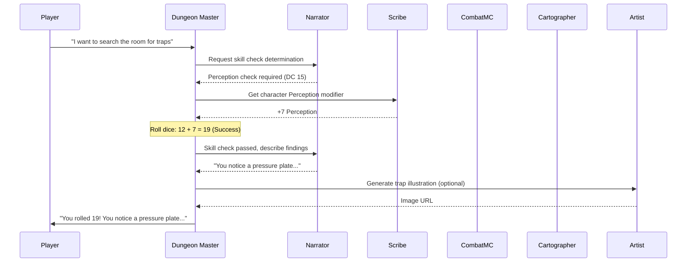

#### Parallel Agent Execution

Some operations benefit from parallel agent execution:

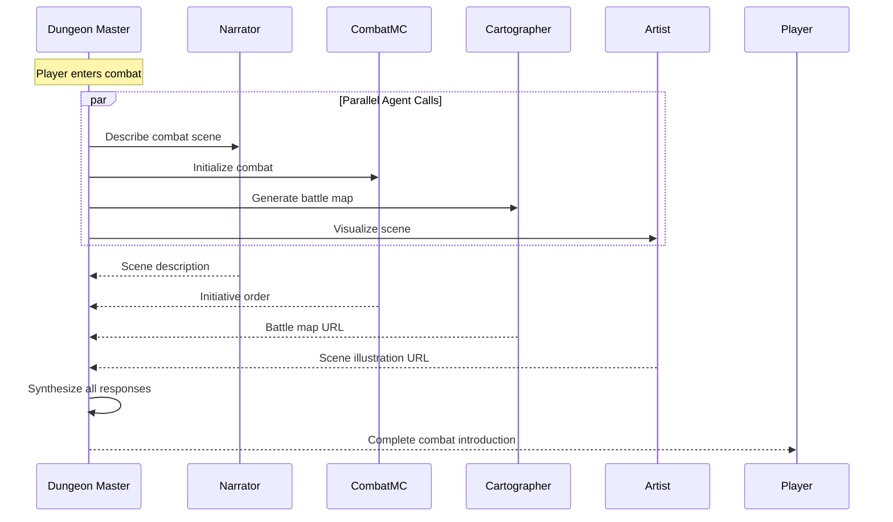

### Plugin System

Plugins provide deterministic, rule-based capabilities to agents:

| Plugin | Purpose | Type | Used By |
|--------|---------|------|---------|
| **Narrative Memory** | Store/retrieve campaign facts | Data Management | Narrator |
| **Rules Engine** | D&D 5e rule validation | Game Logic | Narrator, Scribe, Combat MC |
| **Dice Rolling** | Virtual dice with probabilities | Game Mechanics | Combat MC, Narrator |
| **Image Generation** | DALL-E 3 integration | External API | Artist, Cartographer |
| **Map Generation** | Tactical map creation | External API | Combat Cartographer |
| **Character Visualization** | Portrait generation | External API | Artist |
| **Tactical Analysis** | Combat positioning logic | Game Logic | Combat MC |
| **Terrain Assessment** | Map feature evaluation | Game Logic | Combat Cartographer |

**Plugin Implementation**: Located in `backend/app/plugins/`, each plugin is a Python class with decorated methods callable by agents.

### Agent Context Management

Each agent maintains conversation context through:

1. **Thread Management**: Azure AI Agents SDK manages conversation threads per campaign/session
2. **Message History**: Agents access previous messages for continuity
3. **Shared State**: Database provides shared access to campaign and character data
4. **Plugin State**: Plugins maintain state across invocations (e.g., narrative facts)

### Agent Prompt Engineering

Each agent has a carefully crafted system prompt defining:

- **Role and Personality**: How the agent should present itself
- **Responsibilities**: What the agent is accountable for
- **Constraints**: D&D 5e rules adherence, tone guidelines
- **Output Format**: How to structure responses
- **Collaboration**: How to work with other agents

**Example**: Narrator Agent prompt emphasizes vivid description, D&D 5e accuracy, and maintaining story continuity.

**Location**: Agent prompts are defined in respective agent files under `backend/app/agents/`.

---

## Frontend Architecture

### Component Overview

The frontend is a Single-Page Application (SPA) built with React and TypeScript, providing an immersive interface for D&D gameplay.

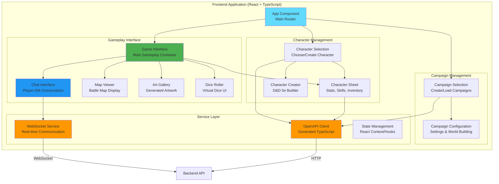

### Key Components

#### Application Shell

**Component**: `App.tsx`

**Responsibilities**:
- Top-level application routing
- Manage application-wide state (selected campaign, character, game mode)
- Handle navigation between campaign selection, character selection, and gameplay
- Coordinate modal dialogs and notifications

**State Managed**:
- Current campaign
- Current character
- Game started status
- Character selection visibility

#### Campaign Selection

**Component**: `CampaignSelection.tsx`

**Responsibilities**:
- Display list of existing campaigns
- Create new campaigns with custom settings
- Load saved campaigns
- Delete campaigns

**User Interactions**:
- View campaign list with metadata
- Click "Create New Campaign" to configure new world
- Select campaign to proceed to character selection

#### Character Selection & Creation

**Components**:
- `CharacterSelection.tsx` - Choose existing or create new character
- `CharacterCreation.tsx` - D&D 5e character builder (if implemented)

**Responsibilities**:
- Display characters associated with selected campaign
- Create new D&D 5e characters with race, class, background
- Validate character creation against D&D 5e rules
- Edit existing characters

**Character Creation Flow**:
1. Select race (Human, Elf, Dwarf, etc.)
2. Select class (Fighter, Wizard, Rogue, etc.)
3. Allocate ability scores
4. Choose background and starting equipment
5. Generate character portrait via Artist agent
6. Save character to campaign

#### Game Interface

**Component**: `GameInterface.tsx`

**Responsibilities**:
- Container for active gameplay
- Layout management for chat, map, art, character sheet
- Coordinate updates from multiple agents
- Handle real-time WebSocket messages

**Layout Structure**:
```
┌─────────────────────────────────────────┐
│          Game Interface                 │
├──────────────────┬──────────────────────┤
│                  │                      │
│  Chat Interface  │   Map Viewer         │
│  (Player-DM)     │   (Battle Maps)      │
│                  │                      │
│                  ├──────────────────────┤
│                  │                      │
│                  │   Art Gallery        │
│                  │   (Artwork)          │
├──────────────────┴──────────────────────┤
│         Character Sheet                 │
│         (Collapsible/Expandable)        │
└─────────────────────────────────────────┘
```

#### Chat Interface

**Component**: `ChatInterface.tsx`

**Responsibilities**:
- Display conversation history between player and AI DM
- Input field for player messages
- Render dice roll results and system notifications
- Stream AI responses in real-time
- Handle message formatting (markdown, code blocks)

**Message Types**:
- Player messages (sent)
- DM messages (received from agent orchestrator)
- System messages (dice rolls, skill checks, combat results)
- Error messages (API failures, validation errors)

**WebSocket Integration**: Listens for real-time messages via WebSocketService and appends to conversation history.

#### Map Viewer

**Component**: `MapViewer.tsx`

**Responsibilities**:
- Display battle maps generated by Combat Cartographer
- Show combatant positions (if grid-based)
- Allow zooming and panning
- Update map as combat progresses

**Image Sources**:
- Generated DALL-E 3 images via Combat Cartographer
- Base64 or URL-based image display
- Loading states during generation

#### Art Gallery

**Component**: `ArtGallery.tsx`

**Responsibilities**:
- Display artwork generated by Artist agent
- Show character portraits
- Present scene illustrations
- Provide image carousel for browsing

**Gallery Features**:
- Thumbnail grid view
- Full-screen image viewing
- Image metadata (title, description, generation timestamp)

#### Character Sheet

**Component**: `CharacterSheet.tsx`

**Responsibilities**:
- Display complete D&D 5e character sheet
- Show real-time stats (HP, spell slots, abilities)
- Allow inventory management
- Display skill modifiers and saving throws
- Track character progression (XP, level)

**Displayed Data**:
- Ability scores (Strength, Dexterity, Constitution, Intelligence, Wisdom, Charisma)
- Skills with proficiency bonuses
- Hit points (current/max)
- Armor class and initiative
- Spell slots (for casters)
- Inventory and equipment
- Features and traits

**Interactivity**:
- Collapsible sections
- Click skills to trigger rolls
- Click items to use/equip
- Expand inventory for detailed view

#### Dice Roller

**Component**: `DiceRoller.tsx` (if standalone)

**Responsibilities**:
- Allow manual dice rolling
- Display roll results with animation
- Support all D&D dice types (d4, d6, d8, d10, d12, d20, d100)
- Calculate modifiers

**User Interactions**:
- Click dice buttons to roll
- Enter modifiers
- See roll breakdown (die result + modifier = total)

### Service Layer

#### OpenAPI Client

**Generated From**: Backend OpenAPI schema

**Generation Command**: `npm run generate:api`

**Location**: `frontend/src/api-client/`

**⚠️ CRITICAL**: Never edit manually - regenerate after backend API changes

**Provided Services**:
- Type-safe API methods for all backend endpoints
- Request/response models matching backend Pydantic models
- Automatic serialization/deserialization
- Error handling structures

**Usage Pattern**:
```typescript
import { CampaignApi, CharacterApi } from './api-client';

const campaignApi = new CampaignApi();
const campaigns = await campaignApi.listCampaigns();
```

#### WebSocket Service

**Component**: Custom service layer

**Responsibilities**:
- Establish WebSocket connection to backend
- Send player messages
- Receive AI agent responses
- Handle connection lifecycle (connect, disconnect, reconnect)
- Emit events for UI components to subscribe

**Message Protocol**:
```typescript
// Outgoing (Player to Backend)
{
  type: "player_message",
  content: "I search for traps",
  campaign_id: "123",
  character_id: "456"
}

// Incoming (Backend to Player)
{
  type: "dm_response",
  content: "You rolled 19! You notice...",
  metadata: {
    dice_roll: { result: 19, die: "d20", modifier: 7 },
    image_url: "https://..."
  }
}
```

#### State Management

**Approach**: React Context API + Hooks

**Key Contexts**:
- `CampaignContext` - Selected campaign and metadata
- `CharacterContext` - Current character state
- `GameContext` - Active game session state
- `WebSocketContext` - WebSocket connection and messages

**Custom Hooks**:
- `useCampaign()` - Access and update campaign data
- `useCharacter()` - Access and update character data
- `useWebSocket()` - Send messages and subscribe to responses
- `useApiClient()` - Centralized API client access

### Data Flow

#### Campaign Creation Flow

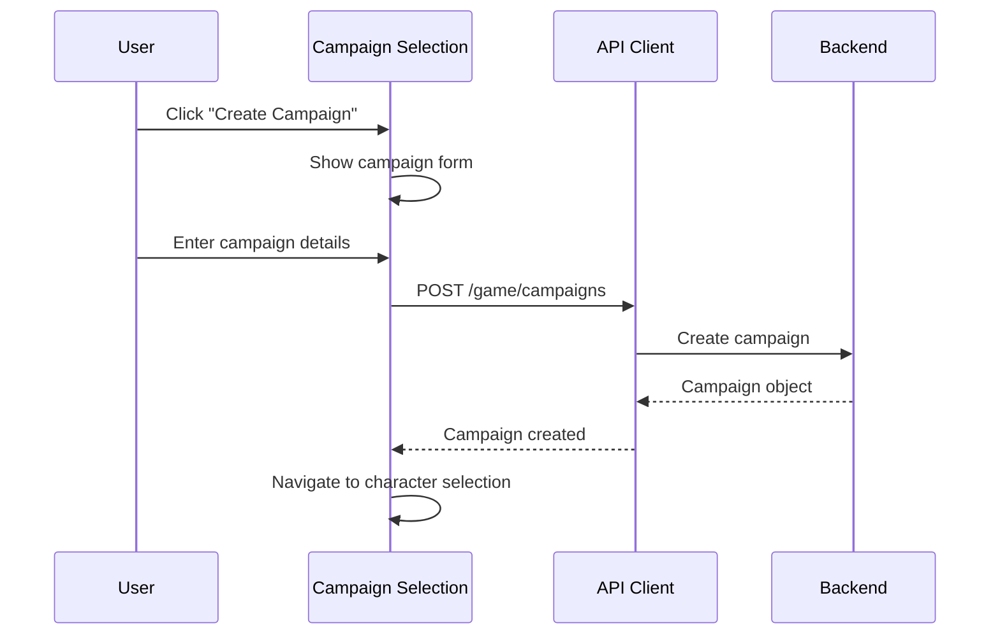

#### Gameplay Message Flow

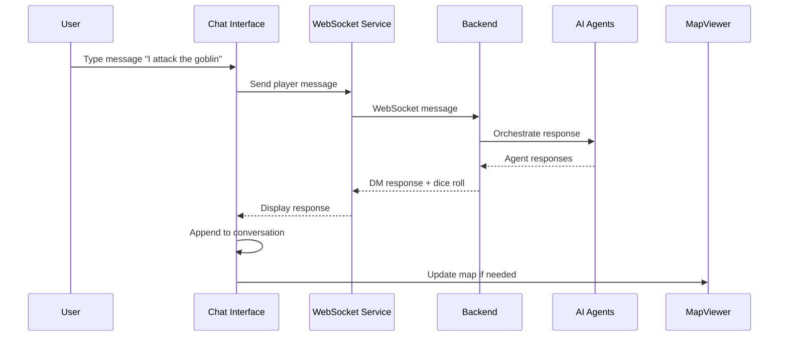

### Styling and Theming

**Technology**: CSS Modules + Material-UI

**Approach**:
- Component-scoped CSS modules
- Material-UI theme customization
- Responsive design with breakpoints
- Dark mode support (future)

**Theme Configuration**: Located in `frontend/src/theme.ts` (if present)

### Build and Development

**Build Tool**: Vite

**Development Server**: `npm run dev` (Port 5173)

**Production Build**: `npm run build`

**Key Scripts**:
- `npm run dev` - Start development server with hot reload
- `npm run build` - TypeScript compilation + production build
- `npm run generate:api` - Regenerate OpenAPI client
- `npm run test:run` - Run Vitest unit tests
- `npm run test:e2e` - Run Playwright E2E tests

### Testing Strategy

**Unit Tests**: Vitest + React Testing Library

**E2E Tests**: Playwright

**Test Coverage Target**:
- 90% statements, branches, functions, lines for new code
- 85% overall project coverage

**Test Locations**:
- Unit tests: `frontend/src/__tests__/` or `*.test.tsx` co-located with components
- E2E tests: `frontend/e2e/*.spec.ts`

**Critical Test Scenarios**:
- Campaign creation workflow
- Character selection and creation
- Chat message sending and receiving
- WebSocket connection resilience
- API error handling

---

## Backend Architecture

### Service Overview

The backend is a Python FastAPI application that orchestrates AI agents, manages game state, and exposes REST/WebSocket APIs.

```mermaid
graph TB
    subgraph "FastAPI Application (backend/app/)"
        Main[main.py<br/>Application Entry]

        subgraph "API Layer"
            GameRoutes[game_routes.py<br/>Campaign & Character APIs]
            WSRoutes[websocket_routes.py<br/>Real-time Gameplay]
        end

        subgraph "Service Layer"
            CampaignService[campaign_service.py<br/>Campaign Management]
            AgentOrchestrator[Agent Orchestrator<br/>Azure AI Agents SDK]
        end

        subgraph "Data Layer"
            Models[models/<br/>Pydantic & SQLAlchemy]
            Database[database.py<br/>SQLAlchemy Engine]
            Migrations[migrations/<br/>Alembic Scripts]
        end

        subgraph "Agent Layer"
            Agents[agents/<br/>6 Specialized Agents]
            Plugins[plugins/<br/>Semantic Kernel Plugins]
        end

        subgraph "Configuration"
            Config[config.py<br/>Settings & Environment]
            SRDData[srd_data.py<br/>D&D 5e Reference]
        end
    end

    subgraph "External"
        AzureAI[Azure AI Foundry<br/>OpenAI Models]
    end

    Main --> GameRoutes
    Main --> WSRoutes
    GameRoutes --> CampaignService
    GameRoutes --> Models
    WSRoutes --> AgentOrchestrator
    CampaignService --> Database
    AgentOrchestrator --> Agents
    Agents --> Plugins
    Plugins --> SRDData
    Agents --> AzureAI
    Models --> Database
    Database --> Migrations

    style Main fill:#009688
    style AgentOrchestrator fill:#FF6F00
    style Agents fill:#FFA726
    style Plugins fill:#FFB74D
    style Database fill:#003B57
    style AzureAI fill:#0078D4
```

### Application Entry Point

**File**: `backend/app/main.py`

**Responsibilities**:
- Initialize FastAPI application
- Configure CORS middleware
- Include API routers
- Define lifespan events for startup/shutdown
- Expose OpenAPI documentation

**Lifespan Events**:

```python
@asynccontextmanager
async def lifespan(app: FastAPI):
    # Startup
    init_settings()  # Load configuration
    run_migrations()  # Apply database migrations
    campaign_service.create_template_campaigns()  # Seed default campaigns

    yield

    # Shutdown (cleanup if needed)
```

**Middleware Configuration**:
- CORS: Allow all origins (restrict in production)
- OpenAPI: Auto-generated at `/docs` (Swagger UI) and `/openapi.json`

**Health Check**: `GET /health` returns `{"status": "ok", "version": "0.1.0"}`

### API Layer

#### REST API (game_routes.py)

**Base Path**: `/game`

**Endpoints**:

| Method | Endpoint | Purpose |
|--------|----------|---------|
| `GET` | `/campaigns` | List all campaigns |
| `POST` | `/campaigns` | Create new campaign |
| `GET` | `/campaigns/{id}` | Get campaign details |
| `DELETE` | `/campaigns/{id}` | Delete campaign |
| `GET` | `/campaigns/{id}/characters` | List characters in campaign |
| `POST` | `/campaigns/{id}/characters` | Create new character |
| `GET` | `/characters/{id}` | Get character details |
| `PUT` | `/characters/{id}` | Update character |
| `DELETE` | `/characters/{id}` | Delete character |

**Request/Response Models**: Pydantic models in `app/models/game_models.py`

**Example Response**:
```json
{
  "id": "123e4567-e89b-12d3-a456-426614174000",
  "name": "The Lost Mines of Phandelver",
  "description": "A classic D&D adventure",
  "setting": "Forgotten Realms",
  "tone": "High Fantasy",
  "created_at": "2025-10-15T10:30:00Z"
}
```

#### WebSocket API (websocket_routes.py)

**Endpoint**: `/ws/game/{campaign_id}/{character_id}`

**Protocol**: WebSocket (bidirectional)

**Purpose**: Real-time gameplay communication between player and AI DM

**Message Types**:

**Incoming (Player → Backend)**:
```json
{
  "type": "player_message",
  "content": "I search the room for hidden doors",
  "timestamp": "2025-10-15T10:35:00Z"
}
```

**Outgoing (Backend → Player)**:
```json
{
  "type": "dm_response",
  "content": "You rolled a 19 on your Investigation check! You notice...",
  "metadata": {
    "agent": "narrator",
    "dice_rolls": [
      {"die": "d20", "result": 12, "modifier": 7, "total": 19}
    ],
    "images": []
  },
  "timestamp": "2025-10-15T10:35:05Z"
}
```

**Connection Lifecycle**:
1. Client connects with campaign ID and character ID
2. Backend validates session and loads game state
3. Messages stream bidirectionally
4. Backend orchestrates AI agent responses
5. Connection maintained until closed by either party

### Service Layer

#### Campaign Service

**File**: `backend/app/services/campaign_service.py`

**Responsibilities**:
- CRUD operations for campaigns
- Template campaign creation (default starter campaigns)
- Campaign state management
- Character association with campaigns

**Key Methods**:
- `create_campaign(data: CampaignCreate) -> Campaign`
- `get_campaign(campaign_id: UUID) -> Campaign`
- `list_campaigns() -> List[Campaign]`
- `delete_campaign(campaign_id: UUID) -> bool`
- `create_template_campaigns()` - Seed database with starter campaigns

#### Agent Orchestration Service

**Integration**: Azure AI Agents SDK (azure-ai-agents, azure-ai-projects)

**Responsibilities**:
- Initialize agent client with Azure AI Foundry endpoint
- Create agent threads for campaign sessions
- Route player messages to appropriate agents
- Manage agent runs and retrieve responses
- Handle agent tool/plugin invocations

**Agent Client Setup** (`backend/app/agent_client_setup.py`):
```python
from azure.ai.projects import AIProjectClient
from azure.ai.agents import AgentsClient

# Initialize project client with endpoint and credentials
project_client = AIProjectClient.from_connection_string(
    conn_str=settings.AZURE_AI_PROJECT_CONNECTION_STRING
)

# Create agents client for orchestration
agents_client = project_client.agents
```

**Agent Orchestration Flow**:
1. Receive player message via WebSocket
2. Retrieve campaign thread from database or create new
3. Add player message to thread
4. Invoke Dungeon Master agent (orchestrator)
5. DM agent routes to specialized agents as needed
6. Collect agent responses
7. Stream synthesized response back to player

### Data Layer

#### Data Models

**Location**: `backend/app/models/`

**Model Types**:

1. **Pydantic Models** (`game_models.py`):
   - API request/response schemas
   - Data validation and serialization
   - Type definitions for TypeScript client generation

2. **SQLAlchemy ORM Models** (`db_models.py`):
   - Database table definitions
   - Relationships and foreign keys
   - Query interfaces

**Key Models**:

**Campaign**:
```python
class Campaign(BaseModel):
    id: UUID
    name: str
    description: str
    setting: str
    tone: str
    homebrew_rules: Optional[str]
    created_at: datetime
    updated_at: datetime
```

**Character** (D&D 5e):
```python
class Character(BaseModel):
    id: UUID
    campaign_id: UUID
    name: str
    race: str
    character_class: str
    level: int
    experience_points: int

    # Ability Scores
    strength: int
    dexterity: int
    constitution: int
    intelligence: int
    wisdom: int
    charisma: int

    # Derived Stats
    armor_class: int
    hit_points_current: int
    hit_points_max: int
    proficiency_bonus: int

    # Character Details
    background: str
    alignment: str
    inventory: List[Item]
    equipped_items: List[str]
    spell_slots: Optional[Dict[int, int]]  # Level -> count
    prepared_spells: Optional[List[str]]
```

#### Database Management

**Technology**: SQLAlchemy + Alembic

**Database File** (Development): `backend/game.db` (SQLite)

**Production**: PostgreSQL (via Azure Database for PostgreSQL)

**Migration Management**:
- Location: `backend/migrations/`
- Tool: Alembic
- Run migrations: `alembic upgrade head`
- Create migration: `alembic revision --autogenerate -m "description"`

**Migration Runner** (`backend/app/migration_runner.py`):
- Automatically runs migrations on application startup
- Ensures database schema is up-to-date

**Key Tables**:
- `campaigns` - Campaign metadata and settings
- `characters` - Full D&D 5e character sheets
- `game_sessions` - Session history and logs
- `narrative_facts` - Story continuity data
- `npcs` - NPC stat blocks and info
- `agent_threads` - Azure AI agent thread IDs

### Agent Layer

**Location**: `backend/app/agents/`

**Agent Files**:
- `dungeon_master_agent.py` - Orchestrator agent
- `narrator_agent.py` - Storytelling agent
- `scribe_agent.py` - Character management agent
- `combat_mc_agent.py` - Combat orchestration agent
- `combat_cartographer_agent.py` - Map generation agent
- `artist_agent.py` - Visual asset generation agent

**Agent Structure**:

Each agent file defines:
1. **System Prompt**: Role, personality, responsibilities
2. **Tools**: Plugins the agent can invoke
3. **Instructions**: Specific guidance for agent behavior
4. **Model Configuration**: Which Azure OpenAI model to use

**Example Agent Definition**:
```python
# Narrator Agent
narrator_agent = {
    "model": "gpt-4o-mini",
    "name": "Narrator",
    "instructions": """
    You are the Narrator agent in a D&D 5e game. Your role is to:
    - Generate vivid environmental descriptions
    - Determine skill check requirements
    - Maintain story continuity and campaign facts
    - Create compelling NPC dialogue
    Always follow D&D 5e rules and maintain consistency with the campaign setting.
    """,
    "tools": [
        narrative_memory_plugin,
        rules_engine_plugin,
        narrative_generation_plugin
    ]
}
```

### Plugin System

**Location**: `backend/app/plugins/`

**Plugin Files**:

| Plugin | Purpose | Key Functions |
|--------|---------|---------------|
| `narrative_memory_plugin.py` | Store/retrieve campaign facts | `store_fact()`, `retrieve_facts()` |
| `rules_engine_plugin.py` | D&D 5e rule validation | `validate_action()`, `calculate_dc()` |
| `dice.py` (utility) | Virtual dice rolling | `roll_dice(die_type, modifier)` |
| `image_generation_plugin.py` | DALL-E 3 integration | `generate_image(prompt)` |
| `map_generation_plugin.py` | Battle map creation | `generate_battle_map(context)` |
| `character_visualization_plugin.py` | Portrait generation | `generate_portrait(character)` |

**Plugin Pattern**:

Plugins are Python functions with decorators that make them callable by agents:

```python
from semantic_kernel.functions import kernel_function

class NarrativeMemoryPlugin:
    @kernel_function(name="store_narrative_fact")
    def store_fact(self, fact: str, campaign_id: str) -> str:
        """Store an important narrative fact for future recall."""
        # Implementation
        return "Fact stored successfully"

    @kernel_function(name="retrieve_narrative_facts")
    def retrieve_facts(self, query: str, campaign_id: str) -> List[str]:
        """Retrieve relevant narrative facts based on query."""
        # Implementation
        return ["fact1", "fact2", "fact3"]
```

**Plugin Registration**: Plugins are registered with agents during initialization, making their functions available for agent invocation.

### Configuration Management

**File**: `backend/app/config.py`

**Configuration Source**: Environment variables + `.env` file

**Key Settings**:

```python
class Settings(BaseSettings):
    # Application
    APP_HOST: str = "0.0.0.0"
    APP_PORT: int = 8000
    APP_DEBUG: bool = False
    APP_LOG_LEVEL: str = "INFO"

    # Azure AI
    AZURE_OPENAI_ENDPOINT: str
    AZURE_OPENAI_API_KEY: str
    AZURE_OPENAI_CHAT_DEPLOYMENT: str = "gpt-4o-mini"
    AZURE_OPENAI_EMBEDDING_DEPLOYMENT: str = "text-embedding-ada-002"
    AZURE_OPENAI_DALLE_DEPLOYMENT: str = "dall-e-3"

    # Database
    DATABASE_URL: str = "sqlite:///./game.db"

    class Config:
        env_file = ".env"
        case_sensitive = True
```

**Usage**: `settings = Settings()` loads configuration once at startup

### D&D 5e SRD Data

**File**: `backend/app/srd_data.py`

**Purpose**: Reference data for D&D 5e System Reference Document

**Included Data**:
- Classes (Fighter, Wizard, Rogue, etc.)
- Races (Human, Elf, Dwarf, etc.)
- Spells with full descriptions
- Equipment and weapons
- Monsters and stat blocks
- Conditions and status effects
- Experience point thresholds for leveling

**Usage**: Imported by plugins and agents for rules validation and content generation

### Testing Infrastructure

**Framework**: pytest + pytest-asyncio

**Test Location**: `backend/tests/`

**Test Structure**:
```
tests/
├── conftest.py                # Fixtures and test configuration
├── factories/                 # Factory classes for test data
│   ├── campaign_factory.py
│   └── character_factory.py
├── unit/                      # Unit tests
│   ├── test_agents/
│   ├── test_plugins/
│   └── test_services/
└── integration/               # Integration tests
    ├── test_api/
    └── test_database/
```

**Key Test Fixtures**:
- `db_session` - Test database session
- `client` - FastAPI test client
- `mock_azure_openai` - Mocked Azure OpenAI responses
- `sample_campaign` - Factory-generated campaign
- `sample_character` - Factory-generated D&D 5e character

**Running Tests**:
```bash
# All tests
make test

# Specific test file
pytest tests/unit/test_services/test_campaign_service.py -v

# With coverage
pytest --cov=app tests/
```

**Coverage Target**: 85% overall, 90% for new code

### Error Handling and Logging

**Logging Configuration**:
- Level: Set via `APP_LOG_LEVEL` environment variable
- Format: Timestamp, logger name, level, message
- Output: Console (captured by container logs in production)

**Error Responses**:

Standard error format:
```json
{
  "detail": "Campaign not found",
  "status_code": 404
}
```

**Exception Handling**:
- FastAPI exception handlers for common errors
- Agent errors wrapped and logged
- Azure OpenAI errors with retry logic

---

## Workflow Sequences

### Campaign Creation Workflow

Complete end-to-end workflow for creating and starting a new campaign:

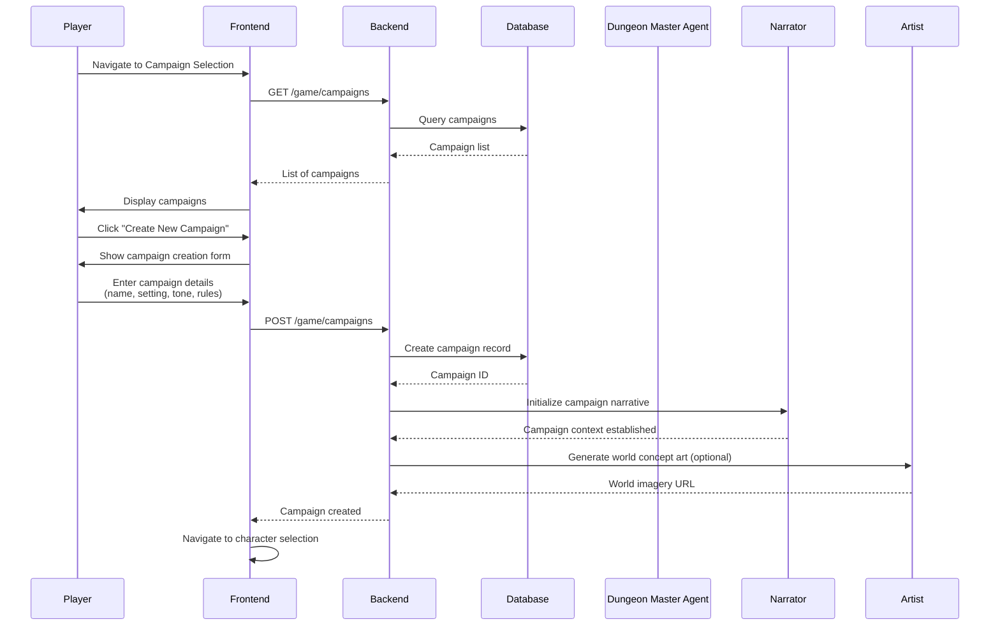

### Character Creation Workflow

Creating a D&D 5e character for a campaign:

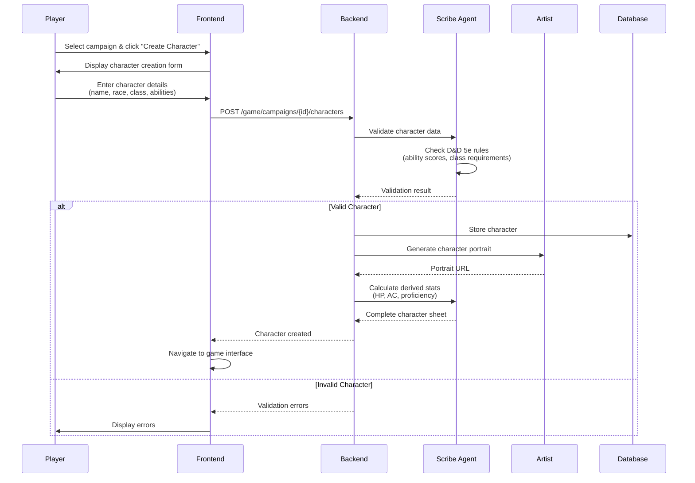

### Standard Gameplay Loop

The core interaction loop during active gameplay:

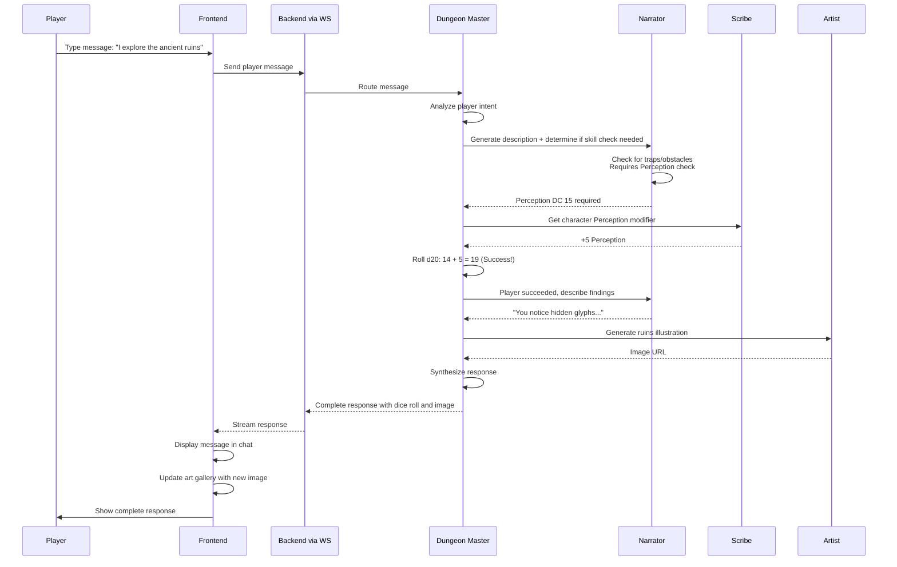

### Combat Workflow

Complete combat encounter from initiation to resolution:

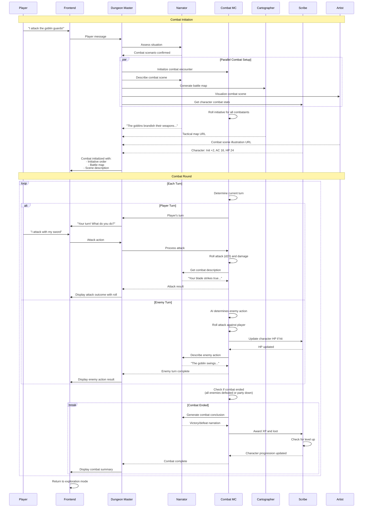

### Session Save and Resume

Persisting and restoring game state:

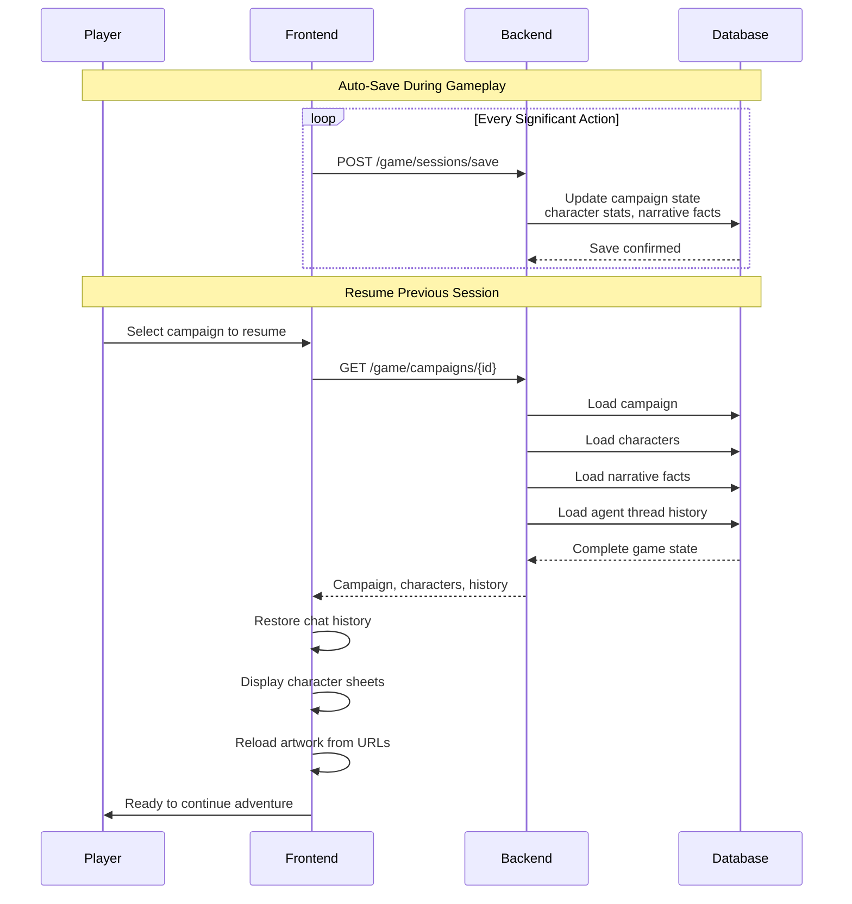

---

## Data Architecture

### Entity Relationship Diagram

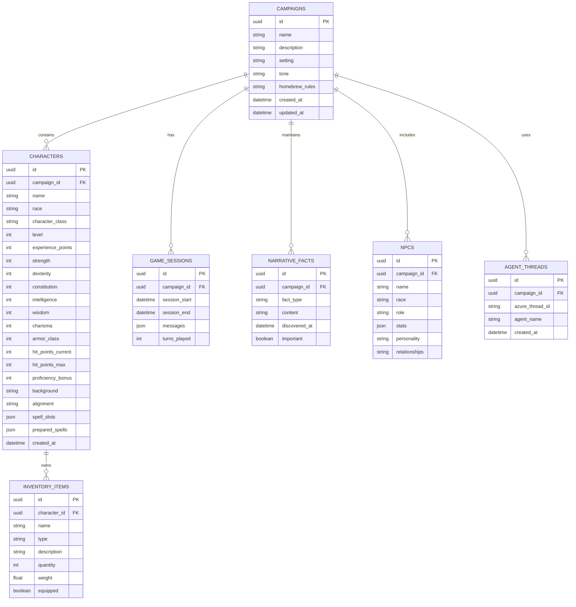

### Data Storage Strategy

#### Campaign Data

**Storage**: SQLite (dev), PostgreSQL (production)

**Schema**: `campaigns` table

**Versioning**: Alembic migrations track schema changes

**Backup Strategy** (Production):
- Automated daily backups via Azure Database for PostgreSQL
- Point-in-time recovery for last 7 days
- Geo-redundant backup storage

#### Character Sheets

**Format**: Normalized relational data with JSON columns for complex attributes

**Complex Attributes** (stored as JSON):
- `inventory`: List of items with quantities
- `spell_slots`: Dictionary mapping spell level to slot count
- `prepared_spells`: List of spell names

**Why JSON?**: D&D 5e character sheets have variable structures based on class (spellcasters vs. non-spellcasters, different equipment sets)

#### Narrative Facts

**Purpose**: Enable story continuity across sessions

**Storage**: `narrative_facts` table

**Fact Types**:
- `plot_point`: Major story developments
- `npc_relationship`: Character interactions
- `world_fact`: Setting details
- `quest_status`: Active/completed quests

**Retrieval**: Narrator agent queries facts by campaign_id and fact_type for context

#### Agent Thread Persistence

**Purpose**: Maintain conversation context across sessions

**Storage**: `agent_threads` table maps campaign → Azure AI thread ID

**Lifecycle**:
1. First gameplay session creates threads for all agents
2. Thread IDs stored in database
3. Subsequent sessions reuse threads for continuity
4. Threads deleted when campaign is deleted

### Caching Strategy

**In-Memory Caching**: None currently (stateless backend)

**Future Considerations**:
- Redis cache for frequently accessed campaign data
- Cache character sheets during active gameplay
- Cache narrative facts for current session

---

## Deployment Architecture

### Azure Production Deployment

```mermaid
graph TB
    subgraph "User Access"
        Browser[Player Browser]
    end

    subgraph "Azure Static Web Apps"
        FrontendHost[Static Web App<br/>React Frontend<br/>CDN Distribution]
    end

    subgraph "Azure Container Apps"
        BackendContainer[Container App<br/>FastAPI Backend<br/>Automatic Scaling]
    end

    subgraph "Azure AI Foundry"
        AIProject[AI Foundry Project]
        GPT4[GPT-4o-mini Deployment]
        Embeddings[text-embedding-ada-002]
        DALLE[DALL-E 3 Deployment]
    end

    subgraph "Azure Database"
        PostgreSQL[(Azure Database<br/>for PostgreSQL<br/>Flexible Server)]
    end

    subgraph "Azure Storage"
        BlobStorage[Blob Storage<br/>Generated Images<br/>Static Assets]
    end

    subgraph "Azure Monitor"
        AppInsights[Application Insights<br/>Telemetry & Logging]
        LogAnalytics[Log Analytics<br/>Metrics & Alerts]
    end

    Browser -->|HTTPS| FrontendHost
    FrontendHost -->|REST/WebSocket| BackendContainer
    BackendContainer -->|Agent SDK| AIProject
    AIProject -->|Chat Completion| GPT4
    AIProject -->|Embeddings| Embeddings
    AIProject -->|Image Gen| DALLE
    BackendContainer -->|SQL| PostgreSQL
    BackendContainer -->|Store Images| BlobStorage
    FrontendHost -->|Load Images| BlobStorage
    BackendContainer -->|Telemetry| AppInsights
    BackendContainer -->|Logs| LogAnalytics

    style Browser fill:#e1f5ff
    style FrontendHost fill:#61DAFB
    style BackendContainer fill:#009688
    style AIProject fill:#FF6F00
    style GPT4 fill:#0078D4
    style Embeddings fill:#0078D4
    style DALLE fill:#0078D4
    style PostgreSQL fill:#003B57
    style BlobStorage fill:#0078D4
    style AppInsights fill:#00B4D8
    style LogAnalytics fill:#00B4D8
```

### Deployment Configuration

#### Frontend Deployment

**Platform**: Azure Static Web Apps

**Build Configuration**:
```yaml
app_location: "frontend"
app_build_command: "npm run build"
output_location: "dist"
api_location: ""  # No backend API in Static Web App
```

**Custom Domain**: Configurable via Azure Portal

**CDN**: Automatic global CDN distribution

**Environment Variables**: Set via Azure Portal configuration

#### Backend Deployment

**Platform**: Azure Container Apps

**Container Image**: Built from `Dockerfile` and pushed to Azure Container Registry

**Scaling Configuration**:
- Min replicas: 1
- Max replicas: 10
- Scale trigger: HTTP request count
- Scale threshold: 100 concurrent requests per replica

**Environment Variables**:
- `AZURE_OPENAI_ENDPOINT` - From Azure AI Foundry
- `AZURE_OPENAI_API_KEY` - From Key Vault
- `DATABASE_URL` - PostgreSQL connection string
- `APP_LOG_LEVEL` - Set to `INFO` in production

**Health Probes**:
- Liveness: `GET /health`
- Readiness: `GET /health`

#### Database Deployment

**Platform**: Azure Database for PostgreSQL Flexible Server

**Configuration**:
- Compute: Burstable B1ms (dev), General Purpose D2s_v3 (production)
- Storage: 32 GB with auto-grow enabled
- Backup: 7-day retention, geo-redundant
- High Availability: Zone-redundant (production)

**Connection**:
- SSL required
- Virtual Network integration for security

#### CI/CD Pipeline

**Tool**: GitHub Actions

**Workflows**:

1. **Unit Tests** (`.github/workflows/unit-tests.yml`):
   - Triggers: Push to any branch, PR to main
   - Runs: Backend pytest, frontend Vitest
   - Required: Must pass before merge

2. **Integration Tests** (`.github/workflows/integration-tests.yml`):
   - Triggers: Push to main, PR to main
   - Runs: API integration tests, E2E Playwright tests
   - Uses: Secrets for Azure OpenAI

3. **Deploy Production** (`.github/workflows/deploy-production.yml`):
   - Triggers: Push to main branch
   - Steps:
     1. Build frontend: `npm run build`
     2. Deploy frontend to Azure Static Web Apps
     3. Build backend Docker image
     4. Push image to Azure Container Registry
     5. Deploy container to Azure Container Apps
     6. Run database migrations
   - Requires: Azure credentials in GitHub Secrets

4. **PR Environments** (`.github/workflows/pr-environments.yml`):
   - Triggers: PR opened/updated targeting main
   - Creates temporary Azure environment for testing
   - Deploys PR code to temporary resources
   - Cleanup: Deletes resources when PR closes

**Required Secrets**:
- `AZURE_CREDENTIALS` - Service principal for deployment
- `AZURE_SUBSCRIPTION_ID`
- `AZURE_OPENAI_ENDPOINT`
- `AZURE_OPENAI_API_KEY`
- `AZURE_OPENAI_CHAT_DEPLOYMENT`

### Infrastructure as Code

**Tool**: Azure Developer CLI (azd)

**Configuration**: `azure.yaml`

**Deployment Command**:
```bash
azd up
```

This single command:
1. Provisions all Azure resources (Container Apps, Static Web App, Database, AI Foundry)
2. Builds and deploys frontend
3. Builds and deploys backend container
4. Configures environment variables
5. Sets up monitoring and logging

### Monitoring and Observability

**Application Insights**:
- Request telemetry for all API calls
- Exception tracking
- Performance metrics (response times, throughput)
- Custom events for agent invocations

**Log Analytics**:
- Centralized logging from all containers
- Query language (KQL) for log analysis
- Alerts for error rates, latency spikes

**OpenTelemetry Integration** (via Azure AI Agents SDK):
- Automatic tracing for agent operations
- Track agent invocation times
- Monitor plugin execution
- Trace multi-agent workflows

**Dashboards**:
- Real-time metrics on Azure Portal
- Custom dashboards for campaign activity
- Agent performance monitoring

---

## Technology Stack

### Frontend

| Category | Technology | Version | Purpose |
|----------|------------|---------|---------|
| **Language** | TypeScript | ~5.x | Type-safe JavaScript |
| **Framework** | React | 18.x | UI component library |
| **Build Tool** | Vite | 5.x | Fast build and dev server |
| **UI Library** | Material-UI | 5.x | Component library |
| **API Client** | OpenAPI Generator | Latest | Auto-generated TypeScript client |
| **State Management** | React Context + Hooks | Built-in | Application state |
| **Testing** | Vitest + Testing Library | Latest | Unit and component tests |
| **E2E Testing** | Playwright | Latest | End-to-end tests |
| **Linting** | Biome | Latest | Code quality and formatting |

### Backend

| Category | Technology | Version | Purpose |
|----------|------------|---------|---------|
| **Language** | Python | 3.12+ | Backend language |
| **Framework** | FastAPI | Latest | Web framework |
| **Package Manager** | UV | Latest | Fast Python dependency management |
| **Web Server** | Uvicorn | Latest | ASGI server |
| **AI Framework** | Azure AI Agents SDK | Latest | Multi-agent orchestration |
| **AI Project Client** | azure-ai-projects | Latest | Azure AI Foundry integration |
| **AI Inference** | Azure AI Inference | Latest | OpenAI model access |
| **ORM** | SQLAlchemy | 2.x | Database abstraction |
| **Migrations** | Alembic | Latest | Database schema versioning |
| **Testing** | pytest + pytest-asyncio | Latest | Unit and integration tests |
| **Linting/Formatting** | Ruff | Latest | Fast Python linter and formatter |

### Infrastructure & Deployment

| Category | Technology | Purpose |
|----------|------------|---------|
| **Frontend Host** | Azure Static Web Apps | SPA hosting with CDN |
| **Backend Host** | Azure Container Apps | Serverless containers with auto-scaling |
| **Container Registry** | Azure Container Registry | Docker image storage |
| **Database (Dev)** | SQLite | Local development database |
| **Database (Prod)** | Azure Database for PostgreSQL | Production database |
| **Image Storage** | Azure Blob Storage | DALL-E generated images |
| **AI Platform** | Azure AI Foundry | Unified AI model deployment |
| **Monitoring** | Azure Application Insights | Telemetry and logging |
| **CI/CD** | GitHub Actions | Automated testing and deployment |
| **IaC** | Azure Developer CLI (azd) | Infrastructure provisioning |

### AI Models

| Model | Purpose | Deployment |
|-------|---------|------------|
| **GPT-4o-mini** | Chat completion for all 6 agents | Azure OpenAI via AI Foundry |
| **text-embedding-ada-002** | Embeddings for semantic search (future) | Azure OpenAI via AI Foundry |
| **DALL-E 3** | Image generation (maps, artwork, portraits) | Azure OpenAI via AI Foundry |

---

## Key Architectural Decisions

For detailed architectural decision records, see [ADR Index](adr/index.md).

### Highlights

1. **[ADR-0018: Azure AI Agents SDK Adoption](adr/0018-azure-ai-agents-sdk-adoption.md)**
   - **Decision**: Migrate from Semantic Kernel to Azure AI Agents SDK
   - **Rationale**: Production-grade agent orchestration, OpenTelemetry observability, better Azure integration
   - **Impact**: Improved agent coordination and monitoring

2. **[ADR-0002: Specialized Multi-Agent Architecture](adr/0002-specialized-multi-agent-architecture.md)**
   - **Decision**: Use 6 specialized agents vs. single large agent
   - **Rationale**: Better separation of concerns, optimized token usage, specialized expertise
   - **Impact**: More maintainable and effective AI system

3. **[ADR-0004: React TypeScript Frontend](adr/0004-react-typescript-frontend.md)**
   - **Decision**: Use React with TypeScript for frontend
   - **Rationale**: Type safety, component reusability, strong ecosystem
   - **Impact**: Robust and maintainable UI

4. **[ADR-0011: OpenAPI Client Generation](adr/0011-openapi-client-generation.md)**
   - **Decision**: Auto-generate TypeScript client from backend OpenAPI schema
   - **Rationale**: Type safety, automatic synchronization, reduced manual work
   - **Impact**: Fewer integration bugs, faster development

5. **[ADR-0009: Container App Deployment Strategy](adr/0009-container-app-deployment-strategy.md)**
   - **Decision**: Deploy backend to Azure Container Apps
   - **Rationale**: Serverless containers, auto-scaling, cost-effective
   - **Impact**: Scalable production deployment

---

## Conclusion

The Secure the Realm architecture leverages modern cloud-native patterns and AI orchestration to deliver an immersive D&D 5e experience. Key architectural strengths include:

- **Specialized AI Agents**: Six agents with distinct roles provide expertise across storytelling, rules, combat, and visuals
- **Azure AI Agents SDK**: Production-grade orchestration with built-in observability
- **Type-Safe Integration**: OpenAPI-generated client ensures frontend/backend consistency
- **Scalable Infrastructure**: Azure Container Apps and Static Web Apps provide cost-effective scaling
- **D&D 5e Fidelity**: Complete SRD compliance with automated rules enforcement

The architecture is designed for future enhancements including multiplayer support, voice integration, and advanced AI features while maintaining the core tabletop RPG experience.

For implementation details, see:
- [Product Requirements Document](prd.md)
- [Architecture Decision Records](adr/index.md)
- [Testing Strategy](specs/TESTING_STRATEGY.md)
- [Azure OpenAI Requirements](AZURE_OPENAI_REQUIREMENTS.md)
